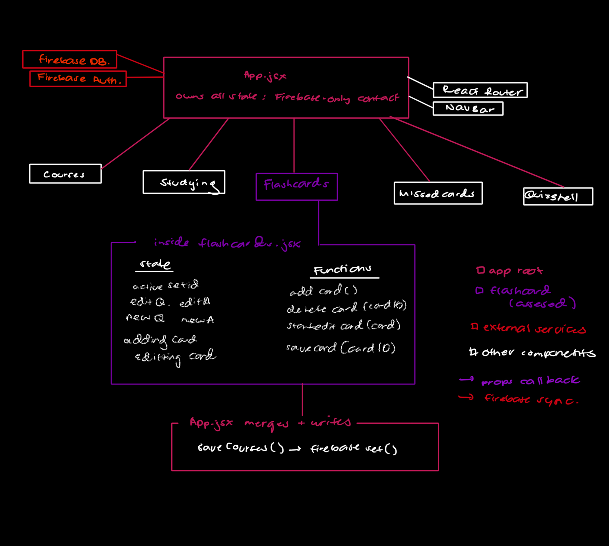
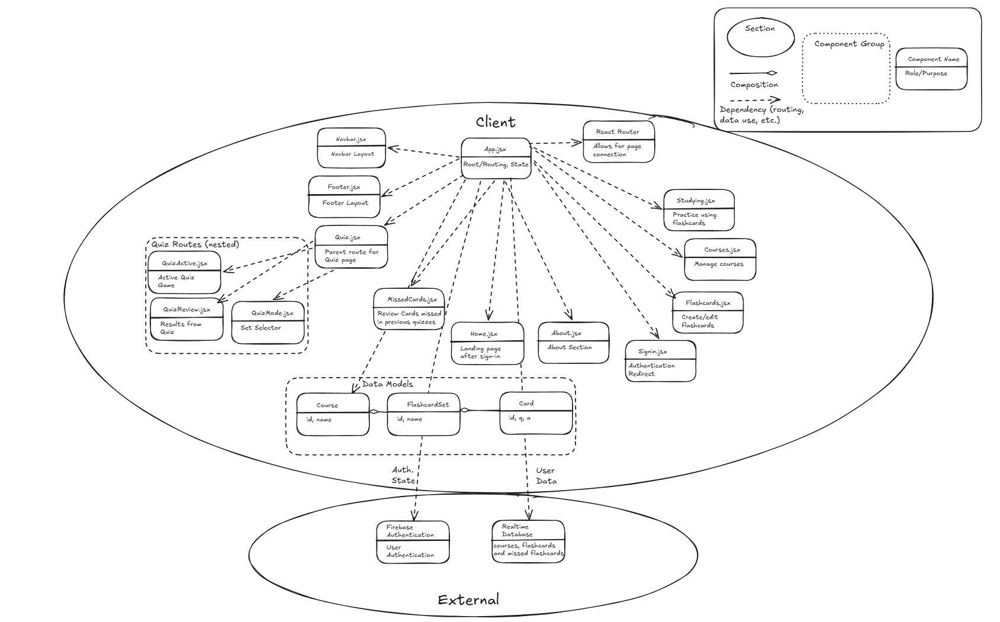
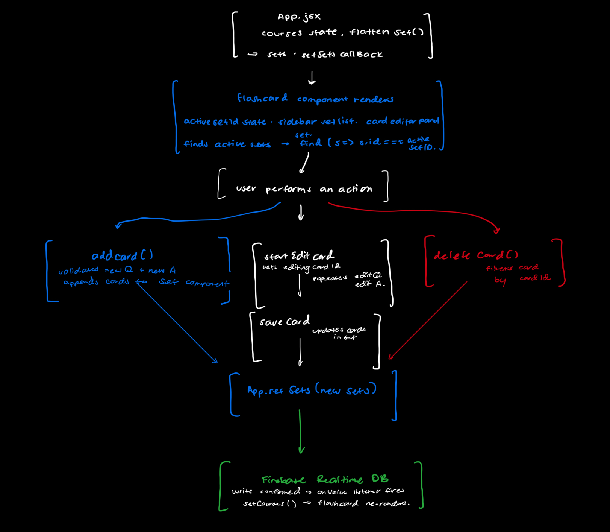

# StudyHuskies

StudyHuskies is a React and Vite app for organizing course flashcards and studying with an adventure-style quiz flow.

## Project Setup

Install dependencies:

```bash
npm install
```
Run the app locally:

```bash
npm run dev
```
## Software Architecture Report

### Overview
This report analyzes the code-level architecture of Study Huskies, a React-based web application developed as a group final project for INFO 340. Study Huskies allows UW students to create courses, build flashcard sets, study cards interactively, take a gamified adventure-style quiz, and review cards they have consistently missed. The codebase is written in JavaScript using React, React Router, Firebase Realtime Database, and Firebase Authentication, and is bundled with Vite.
The report covers four sections: a code structure analysis of the system's architectural elements and process flows, an architecture assessment identifying structural deficiencies in the Flashcards component, a unit test suite verifying the behavior of that component, and a refactoring section documenting how each deficiency was addressed in code.

### Code Structure Analysis

StudyHuskies is structured primarily around React components, using React Router for navigation and Firebase for persistence. The architectural elements are described at the React component level because the application is small enough that individual components represent meaningful units of behavior and responsibility.


## Architectural Elements 

The table below lists each architectural element and its role in the system:

| Element | Type | Purpose |
|---|---|---|
| App.jsx | Root component | Owns global application state and coordinates Firebase communication |
| Navbar | Presentational component | Displays navigation links and authentication controls |
| HomeSection | Page component | Renders the landing page and study feature overview |
| AboutSection | Presentational component | Displays project and application information |
| Flashcards | Page component | Manages flashcard creation, editing, and deletion |
| QuizMode | Page component | Configures quiz sessions and selected sets |
| QuizActive | Stateful page component | Controls quiz gameplay logic and progression |
| QuizReview | Page component | Displays final quiz statistics and missed cards |
| QuizStats | Presentational component | Displays quiz progress, checkpoints, timer, and lives |
| ProgressBar | Presentational component | Visualizes quiz progression |
| Footer | Presentational component | Displays footer information |
| Firebase Auth | External service | Handles authentication state |
| Firebase Realtime Database | External service | Stores course and flashcard data |
| React Router | External library | Manages client-side routing |


### Abstraction Level
The architecture is analyzed primarily at the React component level rather than the individual function level. This abstraction level is appropriate because components represent the major behavioral and structural units of the application. Analyzing smaller helper functions individually would be too granular, while analyzing only at the module level would hide important state-management relationships between components.

## Component Relationships and Dependencies

### **State Ownership**
App.jsx is the central hub of the dependency graph and acts as the global state owner. Shared application state, including courses, flashcard sets, authentication status, missed cards, and quiz lives, is stored and coordinated at this level.

### **Data Flow**
The application follows a unidirectional data flow architecture. State flows downward from App.jsx into child components through props, while state updates flow upward through callback props such as updateCourses, setSets, and saveMissedCards.

### **Routing Dependencies**
React Router coordinates transitions between route-level components. Most pages receive their required data through props from App.jsx. The primary exception is QuizReview.jsx, which receives quiz result data through location.state after navigation from QuizActive.jsx.

### **Firebase Dependencies**

App.jsx is the only component that communicates directly with Firebase. Firebase Authentication is used to monitor login state through onAuthStateChanged, while Firebase Realtime Database is accessed through onValue listeners and set() write operations.

### Flashcard State Transformation

The Flashcards.jsx component receives a flattened sets array derived from nested course data using the flattenSets utility function in App.jsx. When flashcards are modified, the updated flat structure is merged back into the nested course structure before being written to Firebase.

### Figure 1. Component Architecture Diagram
  
*Figure 1: Implementation-level architecture of StudyHuskies showing component hierarchy, state flow, and Firebase connections.*

Figure 1 shows the implementation-level architecture of StudyHuskies, highlighting how App.jsx is the only node that touches Firebase directly and acts as the central hub for all state and data flow. The Flashcards component is highlighted in purple as the assessed element — receiving sets and setSets from App and rendering the card editor UI without needing to know anything about the broader course structure.

### Figure 2. Full System Component Architecture Diagram

*Figure 2: Full system component architecture diagram showing all client-side components, routing dependencies, data models, and external services.*

Figure 2 provides a broader view of the full system, showing how all components relate to one another, how routing connects the pages, and how the data models map to the external Firebase services. Arrows with a diamond shape on the end indicate composition and dashed arrows indicate dependencies on other components such as routing and data use. See the legend in the top right corner for reference.

## Process Flows
This section describes how information moves through the codebase during the three most important interactions in Study Huskies, described at the level of which components render, which state changes, and which functions are called.

#### App initialization and data loading

When the app first loads, App renders with empty courses and missedCards arrays and loading set to true. A useEffect immediately attaches an onAuthStateChanged listener to Firebase Auth. If no user is signed in, currentUser stays null, loading becomes false, and the router renders — protected routes redirect to /signin.

Once a user is authenticated, onAuthStateChanged fires with the Firebase user object and sets currentUser. This triggers a second useEffect which attaches an onValue listener to users/{uid}/courses. When the snapshot arrives, App normalizes the data and calls setCourses. A parallel useEffect does the same for users/{uid}/missedCards. Once both snapshots have arrived, loading becomes false and the full app renders.

#### Adding or editing a card in Flashcards

When a user saves a card in Flashcards, the component calls setSets(newSets) — a callback prop from App. App.setSets merges the updated flat array back into the nested courses structure by matching on set.id, then calls saveCourses(), which calls Firebase set() to overwrite the courses node. The onValue listener fires in response, updating courses state in App, which re-renders Flashcards with the updated card visible.

#### Quiz session
A user navigates to /Quiz, which renders QuizMode. After selecting a set and number of lives, QuizMode calls props.setLives() to update App state, then calls navigate(/quiz/:setId). React Router renders QuizActive, which enters a gameplay loop tracking correct answers, lives, and missed cards. On completion, QuizActive calls navigate(/quiz/:setId/results, { state: scoreData }). React Router renders QuizReview, which reads the score from useLocation().state and displays the results.

### Figure 3. Flashcard DataFlow Diagram

*Figure 3: Data flow diagram showing how add, edit, and delete operations in Flashcards.jsx trigger App.jsx to merge and write the updated data to Firebase.*

Figure 3 highlights the key architectural feature of the Flashcards flow: all three mutation operations — add, edit, and delete — share the same write path through App to Firebase. This is significant because it means Flashcards.jsx never communicates with Firebase directly, keeping data persistence logic centralized in App.jsx. No data ever bypasses App on the way to the database.

## Architecture Assessment
### Selected Element : Flashcards.jsx
This component was chosen because it contains four distinct functions (addCard, deleteCard, startEditCard, saveCard) plus significant state management and JSX rendering logic, making it large enough to exhibit multiple deficiencies across all four assessment lenses. It is also the element covered by the unit test suite and the refactoring work.

   ### Code Deficiencies

   ### Long Function - Entire Component
    The flashcards.jsx component is way too long, making it difficult to test, modify the code, and understand many aspects of the code.
   #### Fix - Extract Class
   In order to reduce the size of the component without impacting the functionality of the site and breaking any of the tests, splitting the component into multiple components (`SetSidebar.jsx`, `CardForm.jsx` and `CardViewer`) and then routing them back to `flashcards.jsx` would maintain all functionality while also making the code much easier to test, reduce the overall size of the function and make it much easier to make additions to this part of the codebase in the future.

   ### Data Clumps - (lines 14-15 and 17-18)
    Occurs in the state declarations - editQ and editA + newQ and newA are never used independently, making the extra state declarations redundant
   #### Fix - Used Introduce Parameter Object Refactoring
    Grouped each pair into a single state object, reducing redundancy throughout the component and making the component a bit more concise
   ```javascript
    const [editCard, setEditCard] = useState({ question: '', answer: '' });
    const [newCard, setNewCard] = useState({ question: '', answer: '' });
   ```
   ### Mysterious Names - (lines 10 - 68)
    Occurs in the state declarations and each of the present functions - question, answer, and set are all abbreviated to q, a, and s respectively, which hurts the overall readability of the codebase. 
   #### Fix - Rename Field 
    Would map q & a to question & answer (cannot explicitly rename q and a due to them being declared like this in Firebase, which changing could affect the entire codebase)
   ```javascript
    setEditCard({ question: card.q, answer: card.a });
   ``` 

   ### Duplicated Code - (SetSidebar.jsx lines 38-40)
   The getCourseName function was called twice unnecessarily, once by the condition and once inside the code, leading to redundancy and increasing the risk of confusion for people reading the codebase. 
   #### Fix - Call courseName in a Variable
   By setting courseName as a variable, it makes it so the `find()` being used twice originally is now only used once at the beginning of the code, and then that variable is called twice instead, reducing redundancy and making the code more clear.  

   ### <a href> was used instead of <Link> - (SetSidebar.jsx line 10)
   Using <a href> goes against naming rules defined by React, which would cause the site to run slower due to the page reloading fully.
   #### Fix - Replace with <Link>
   <Link> is the proper structure that React is looking for, which would avoid any potential issues with a full page reload
   ```javascript
    Add sets in <Link to="/courses" style={{ color: '#800080' }}>Courses</Link>.
   ```

   ### Testability Issue - (SetSidebar.jsx line 29)
   This line was intially calling four different setters, which would be extremely difficult to test.
   #### Fix - Use Existing Functions 
   The selectSet function being used here has the same affect as using the four setters, so replacing those setters with the selectSet function allows for the code to be simpler and much easier to test as well.
   ```javascript
    onClick={() => selectSet(set.id)}
   ```
## Unit Tests
 
### Selected element and rationale
 
The unit tests target the `Flashcards` component (`src/pages/flashcards.jsx`). This component was chosen because it contains four distinct interactive functions (`addCard`, `deleteCard`, `startEditCard`, `saveCard`) plus multiple rendering branches (empty state, card display, add form, edit form), giving a wide range of behaviors to test. The tests verify both the happy paths (normal add/edit/delete, switching sets) and the unhappy paths (saving with blank inputs, canceling forms).

### Test Case Justification

The test suite is organized into five describe blocks: empty state, rendering, 
adding, deleting, and editing. Each test case is named to reflect the specific 
behavior being verified. Tests cover both happy paths (saving a valid card, 
switching sets) and unhappy paths (saving with a blank question or answer, 
canceling forms without saving). The full test suite can be found in 
`src/tests/flashcards.test.jsx`.

### Individual Test Case Justifications

| Test | Justification |
|---|---|
| Shows a message when no sets exist | Verifies the empty state branch renders the correct fallback message when no sets are passed |
| Shows a Courses link in empty state | Ensures a navigation link to Courses is available so the user can create sets |
| Renders the heading | Confirms the component mounts and renders basic UI correctly |
| Renders all set names | Verifies the sidebar correctly displays all sets passed via props |
| Shows the first flashcard by default | Confirms cardIndex initializes to 0 and the first card is shown on load |
| Switches sets when clicked | Verifies that clicking a set in the sidebar updates the active set and displays its first card |
| Shows empty state for sets with no cards | Tests the empty cards branch within an active set renders the correct message |
| Opens the add card form | Verifies the add card form appears when the add button is clicked |
| Saves a new flashcard | Tests the happy path of addCard — verifies setSets is called with the new card appended |
| Does not save with blank question | Tests the unhappy path guard in addCard — setSets should not be called if question is empty |
| Does not save with blank answer | Tests the unhappy path guard in addCard — setSets should not be called if answer is empty |
| Closes the add form on cancel | Verifies cancel hides the add form |
| Deletes a flashcard | Tests deleteCard removes the correct card by ID from the active set |
| Opens edit form with existing values | Verifies startEditCard pre-fills the edit inputs with the current card's question and answer |
| Saves edited flashcard text | Tests the happy path of saveCard — verifies setSets is called with the updated card values |
| Closes edit form without saving | Verifies cancel does not call setSets and hides the edit form |
 
### Testing framework and setup
Tests the `Flashcards` page component. The component receives `sets` and `setSets` as props, and all state mutations are verified through `setSets` mock calls.

### `Flashcards.test.jsx`

| Suite | Test | Description |
|---|---|---|
| **Empty state** | No sets message | Shows fallback text when `sets=[]` |
| | Courses link | Confirms navigation link renders in empty state |
| **Rendering** | Heading | Page-level heading is present |
| | Set names | All set names from props appear in the list |
| | Default card | First set's first card is shown on load |
| | Set switching | Clicking a set name updates the active card view |
| | Empty set | Shows fallback when a set exists but has no cards |
| **Adding cards** | Form opens | `+ Add Card` button reveals the question/answer inputs |
| | Saves new card | `setSets` is called with the new card appended to the correct set |
| | Blank question | Validation blocks save when question is empty |
| | Blank answer | Validation blocks save when answer is empty |
| | Cancel closes form | Form unmounts without calling `setSets` |
| **Deleting cards** | Delete card | `setSets` is called with the target card removed from the set |
| **Editing cards** | Form pre-filled | Edit form inputs are pre-populated with existing card text |
| | Saves edits | `setSets` is called with updated `q` and `a` on the correct card |
| | Cancel discards | Form closes without calling `setSets` |

## Test Conventions
 
- **Cleanup** — `afterEach(cleanup)` is called in `Flashcards.test.jsx` to reset the DOM between tests.
- **Mock data** — Shared `testSets` fixture is defined at the top of `Flashcards.test.jsx` and reused across suites.
- **Mutation assertions** — State changes are verified by passing `vi.fn()` as `setSets` and inspecting `mock.calls[0][0]`.
- **Routing** — The `Flashcards` component is wrapped in `<MemoryRouter>` since it uses React Router links.
 
Tests are implemented using **Vitest** with **React Testing Library**. Vitest integrates with the project's Vite build pipeline. React Testing Library provides `render`, `screen`, and `fireEvent` for mounting components and simulating user interactions.
 
### Testing framework and setup

Tests are implemented using **Vitest** with **React Testing Library**. Vitest integrates with the project's Vite build pipeline. React Testing Library provides `render`, `screen`, and `fireEvent` for mounting components and simulating user interactions.

The test environment is configured in `vite.config.js`:

```js
test: {
  globals: true,
  environment: 'jsdom',
  setupFiles: './src/test/setup.js',
}
```

The setup file (`src/test/setup.js`) imports jest-dom matchers for Vitest and registers a global `cleanup` after each test:

```js
import '@testing-library/jest-dom/vitest';
import { afterEach } from 'vitest';
import { cleanup } from '@testing-library/react';

afterEach(() => {
  cleanup();
});
```

### How to run the tests

**Required dev dependencies:**

```bash
npm install --save-dev vitest @testing-library/react @testing-library/jest-dom @testing-library/dom jsdom --legacy-peer-deps
```

**Run the suite:**

```bash
npm test
```

**Run with coverage:**

```bash
npm run test:coverage
```

### Test Results


*Figure 4: Terminal output showing all 19 tests passing across 2 test files, including all 16 Flashcards component tests.*

Figure 4 shows the results of running the full test suite via `npm run test`. All 16 Flashcards component tests and 3 QuizStats tests pass successfully across 2 test files, with a total duration of 1.38 seconds. The 16 Flashcards tests cover all five describe blocks including empty state, rendering, adding, deleting, and editing, confirming that the refactored component maintains the same behavior as the original across all tested paths.

NOTE: Coverage reporting could not be generated due to a dependency conflict with the project's current package versions. The test case justification table above documents how each function and rendering branch is covered by the 16 tests.

## Contributors

- Nathan Adams
- Momo Tolenoa